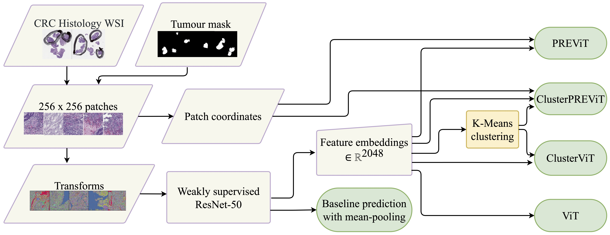

# Enhancing Local Context of Histology Features in Vision Transformers with ClusterPREViT

We propose adjustments to the Vision Transformer (ViT) network to improve the utilisation of contextual information present in whole slide images (WSIs). Firstly, our position restoration embedding (PRE) preserves the spatial relationship between tissue patches, using their original positions on a WSI. Secondly, a clustering analysis of extracted tissue features explores morphological motifs which capture fundamental biological processes found in the tumour micro-environment. This is introduced into the ViT network in the form of a cluster label token, helping the model to differentiate between tissue types.

[Paper](https://link.springer.com/book/9783031196614)

## Workflow

## Repository Structure

Execute the notebooks in the following order:

* Train Baseline ResNet.ipynb to train a ResNet (pre-trained on ImageNet) on your patched WSIs in a weakly supervised manner.

* Save ResNet Feature Embeddings.ipynb to extract and save the feature embeddings for each patch.

* Cluster Baseline Features.ipynb to assign a cluster value to each patch, clustering based on the feature embeddings.

* Train Attention Model.ipynb to train on the baseline feature embeddings to get a slide-level prediction of your outcome variable. Here you choose to train a ViT, PREViT, ClusterViT or ClusterPREViT.

## Data Setup

This code requires your WSIs to be split into patches of size 256x256 pixels and saved as a standard image format.

The image location should follow the format, with the parameters defined in the arguments: 

{image_folder}/{cohort}/{patch_folder}/{slide}/{magnification}/{patch},

where slide is the name of the WSI and patch is the name of the individual patch image. 

The name of the patch file must follow the syntax:

{slide}_{other parameters}_x_{x_coordinate}_y_{y_coordinate}.{file type}

where x_coordinate and y_coordinate correspond to the coordinates of the patch in the WSI.

The names of the patch files should be stored in a csv with one row per patch, along with the slide name, the case/patient ID and the response value that you are trying to predict.
